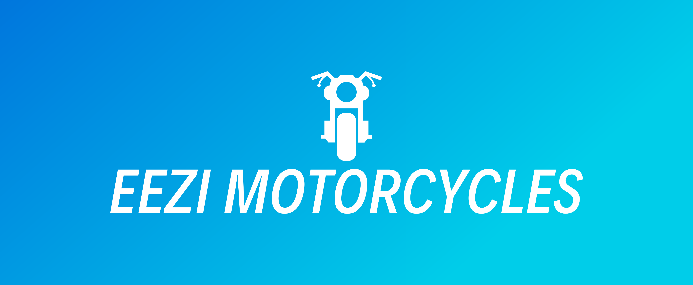

## Eezi Motorcycles
* Eezi Motorcycles is a site created for Code Institute Milestone 4.
* The main purpose of the site is to provide parts and accessories for a Motorcycle.
* A user can order any item in the store. (There is no need to create an account)
* A user can also register an account and then they are able to order an item and view their orders.
* A user can also register an account and then they are able to Create a profile, view their profile, Update their profile or Delete their profile.
* The site can also be maintained by a site manager. A manager can add new items to the store, update details on existing items or delete items from the store.
* A site main admin can do the same as a site manager as well as create user profiles, assign privileges and delete profiles or orders.

## Technologies
Django
Python
HTML
CSS
jquery
bootstrap
Postgrl
AWS

## Deployment
The deployed link for the site is: <https://eezimotorcycles.herokuapp.com/>

## User Experience(UX)

The site has multiple pages as outlined below:
* base.html - This page is the template for all other pages.
* basket.html - This is where a user can view items in their basket.
* checkout.html - This is where a user can pay for their products and checkout.
* confirmcheckout.html - This page provides a confirmation of a users booking.
* contact.html - This is where a user can use a contact form to email the company.
* edit_product.html - This is where an admin can edit an existing product.
* index.html - The main page giving an outline of the purpose of the site.
* new_product.html - This is where an admin can add a new product to the store.
* privacy.html - This is where a user can view the company privacy policy.
* shopping.html - This is where a user can view various products in the store.
* shopping_detail.html - This is where a user can view information about a single item.
* success.html - This is where a user is diverted to when subscribing or contacting the company.
* terms.html - This is where a user can view the company's terms and conditions.
* update_products.html - This is where a manager can update existing products in the store.
* userprofile.html - This is where a user can view, edit or delete their profile.
* allauth - This is where a user can register, login and reset their password.
* blog.html - This is where a user can view blog posts.
* blog_detail.html - This is where a user can view an individual blog.
* add_blog.html - This is where a superuser can add a new blog post.
* edit_blog.html - This is where a superuser can edit blog posts.
* delete_ blog.html - This is where a superuser can delete blog posts.

## User goals

* As a customer, I want to be able to order a product without having to create an account.
* As a customer, I want to able to register an account.
* As a customer, I want to be able to view multiple or single products.
* As a customer, I want to be able to contact the company.
* As a customer, I want to be able to view, update or delete my profile.
* As a customer, I want to see all previous orders in my profile.
* As a customer, I want to see clearly see prices.
* As a customer, I want to see clearly see total prices in the basket before checkout.
* As a customer, I want to see special offers.
* As a customer, I want to search for products by filtering.
* As a customer, I want to be able to search for a product by name.
* As a customer, I want to be able to choose the quantity of items to buy.
* As a customer, I want to be able to add or remove items in the cart.
* As a customer, I want to be able to feel secure when entering payment information.
* As a customer, I want to receive an email when a profile is created.
* As a customer, I want to receive an email when an order is created.
* As a customer, I want to clearly see an outcome whether the order is successful or not.
* As a customer, I want to be able to view blog posts.

* As a manager, I want to be able to create an account.
* As a manager, I want to be able easily log in or out.
* As a manager, I want to be able to reset a password.
* As a manager, I want to be able to receive an email when an account has been created.
* As a manager, I want to be able to view all customers order history.
* As a manager, I want to be able to edit or delete an existing product.
* As a manager, I want to be able to add a new product.
* As a manager, I want to be able to create a new blog post.
* As a manager, I want to be able to edit or delete an existing blog post.

## Design choices

The design is simple with clear layouts providing easy access to order a product, contact the company and view all services and prices.

## Balsamiq

* Balsamiq mockups are in the folder called "Documentation".
* I kept quite close to the original plans. Although the project did grow as I started to build.

## Header and navigation bar

* There is a logo on the top left with link to home page. Visible on all screens.
* Menu resizes for small devices. 
* There is a search bar on this navbar.
* There is a second navbar that hides when the user scrolls. The menu is hidden on mobile.

## Home page (index.html)

* There is a carousel with links to parts, gear and accessories.
* There is a special offer carousel with links to various products.
* There are more links underneath to parts, gear and accessories.

## Products (shopping.html)

* This is where a user can view all or filtered products.

## Product (shopping_detail.html)

* Here a user can view a single product in more detail.
* A user can add the item or multiples of that item to the shopping basket.

## Basket (basket.html)

* A user can see items in the basket (if any)
* A user can continue to checkout or edit the basket or continue shopping.

## Checkout (checkout.html)

* A user can fill out their details and credit card info on the left side (desktop view)
* A user can view items in the basket on the right side (desktop view)
* A user can update quantity in the basket or delete items from the basket.
* A user can also continue shopping.
* A user also has an option to login or create an account to save the order details in their account.

## Confirmcheckout (confirmcheckout.html)

* A user can view details of their order
* A user can also continue shopping.

## Register

* The register page has a simple form for a user to create a user profile.

## Userprofile

* When a user creates a profile on the register page, they are automatically logged in and forwarded to the profile page.
* The user can view or update their profile.
* This page is only available to users who have created a profile and logged in.

## Login

* Contains a simple form with email address and password inputs
* Also contains an option to register

## Contact

* The form has the address and phone number on the side.
* The form contains three inputs; name, email and message.
* The form uses django and saves all messages to a db which is viewable in the admin portal.

## Bikeblog (blog.html)

* This is a simple blog which is managed by the admin portal.
* Anyone can view all blogs.

## BlogDetail (blog_detail.html)

* This is a anyone can view a single blog post.

## AddBlog (add_blog.html)

* This is where a superuser can create a new blog post.

## Editblog (edit_blog.html)

* This is where a superuser can edit an existing blog post.

## Deleteblog (delete_blog.html)

* This is where a superuser can delete an existing blog post.

## Success (success.html)

* This is a simple confirmation page that shows when a user books a service.

## Edit Product (edit_product.html)

* This page allows an admin to edit a product.
* This section is only available to registered admin users.

## New Product (new_product.html)

* This page allows an admin to add a new product.
* This section is only available to registered admin users.

## Footer

* The footer contains links to privacy, terms, contact, subscribe, register and login.
* The footer also contains social media icon links for Facebook & Twitter.
* The links change depending on whether a user is logged in.
* When not logged in, the footer shows the login and register links. When logged in, the footer shows the profile and logout links.
* The footer also contains a copyright notice.

## Future features

* I would have liked to add an Amazon or Ebay api to the site.
* I would also have liked to add multiple images for each product.
* I would like to link existing user accounts to the blog app so users can create their own blogs.

## Tools

* Gitpod - https://gitpod.ie/ - as a code editer and version control.
* Github - https://github.com/ - to share and store code 
* Heroku - https://heroku.com/ - for hosting the application and deployment
* MongoDB https://www.mongodb.com - database for the website

## Libraries and frameworks

* Bootstrap https://getbootstrap.com/ - for layout and responsive design
* Font Awesome - https://fontawesome.com - Icons
* 

## Languages

* HTML
* CSS
* Javascript
* Python 3.8

## Testing

* Site was tested on Windows 10 pc, 2 x android phones, iPhone 8, iPad mini, Android 10" tablet, Dell 13" laptop, Mac 13" laptop. 
* Site was tested on Chrome, Firefox, Edge, Canary, Safari.
* Site was also tested on Browserstack: www.browserstack.com
* Site was tested with https://validator.w3.org
* Site was tested by https://jigsaw.w3.org/css-validator/
* Python code was checked by http://pep8online.com/
* There are a few errors but the code seems fine apart from some lines are too long and doctype is missing.

## Deployment

This application can run on Gitpod or Heroku

## Remote
1: To push the code to a remote GitHub repository, follow the steps below.

2: Next, link your remote repository. For Github, open your Github account and select Repositories. At the top right of the screen select New.

3: Give your repository a name.

4: You can now choose a few different ways to link the local and remote repositories. The one we want here is "…or push an existing repository from the command line". Copy the code this option gives you and paste it into your command line. It should look something like this:

5: git remote add origin https://github.com/eezipc/fullstackframeworks-django
6: git push -u origin master

7: Now you can push any changes from the command line with:

8: git push
9: If you check the status of of your local repository using 'git status' it should give you something like this:

10: On branch master
11: Your branch is up-to-date with 'origin/master'.
12: nothing to commit, working tree clean

13: Finally, to deploy the code live with Github Pages, open the repository in your Github account and select 'Settings' at the top right of the page. 
14: Scroll down to the Github Pages section. 
15: Click on the 'None' button. 
16: Select the correct branch from the menu. 
17: Click on the URL link to visit the deployed site.

*** Note: For the site to load in github, you may need to input a secret key in settings.py**

## Heroku

To push the code to a Heroku and deploy it dynamically, follow the steps below.

1: Create a requirements.txt file using the terminal command pip freeze > requirements.txt.

2: Create a Procfile with the terminal command echo web: python app.py > Procfile.

3: Type git add and git commit the new requirements and Procfile .

4: Create an App on Heroku. 

5: Log in to your previous Heroku account or set up a new one. 

6: Select the "New" button on the top right of the screen. 

7: Then select "Create New App".

8: Give your app a name and choose the regional server that best suits your location.

9: Login to your Heroku account from your Github CLI using:

 heroku login -i

10: You should now be asked to enter your email and password for Heroku.

11: Link your existing Git repository to Heroku by adding Heroku as a remote repository:

heroku git:remote -a <project-name>

12: From now on you can push your code from the CLI with:

git push heroku master

13: Set the necessary Environment Variables. Select the Settings tab, and then select the Config Vars button. Enter the KEY - VALUE pairs for your config variables here (e.g. SECRET_KEY, IP, PORT etc.)

14:Finally, select the Open App button the top right of the screen to see your deployed application.

## Credits
* The vast majority of code was learnt from the Boutique Ado project on Code Institute.
* I also got alot of help from Codemy.com: https://www.youtube.com/channel/UCFB0dxMudkws1q8w5NJEAmw
* I learned alot from www.udemy.com
* I also picked up alot of tips from Linkedin Learning.

## Media

* All images are provided by www.unsplash.com and www.pexels.com 
* Alot of the product images and text was taken from https://www.xlmoto.ie
* Blog posts were taken from various motorcycle blogs such as motorcycle.com and cycleworld.com

## Code

* Most of the code was learnt from Youtube, Udemy and Le Wagon.
* The Code Institute lessons on Django were excellent. Although they had set a low standard.
* All credit for the videos must go to czk8780: https://github.com/ckz8780
* Got alot of help from stackexchange https://stackexchange.com/
* Some of the code for the back to top button came from here https://www.codeply.com/
* Alot of inspiration from Bootstrap: https://www.getbootstrap.com
* Alot of help from W3Schools: https://www.W3Schools.com
